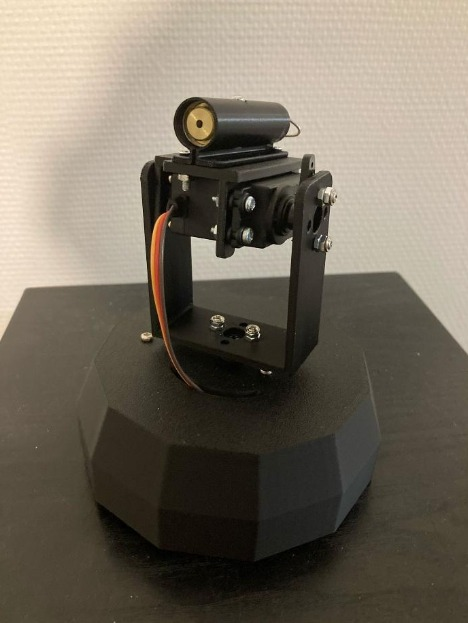

# Mouth-Tracking Turret

During a 5 day hackathon, in a group of 2, we have built a turret that can detect and aim at the open mouth using artificial intelligence. The idea was to make it a candy dispencer that would shoot a candy whenever you open your mouth, but due to the lack of time, the laser was used as a substitution. 

Project consisted of two parts:
The AI model
The turret controlled but the motor

Since the team was very small, I worked of everything, together with my teammate. For the AI model we went with U-net which allowed us to get the location of the open mouth and use that to aim the motor with an Arduino. The model was trained on our own data that we collected during the project.

More detailed information can be found in the report. In the "Videos" folder the working system is showcased.

